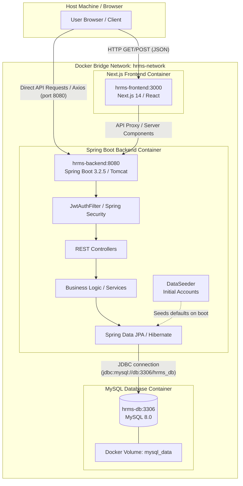
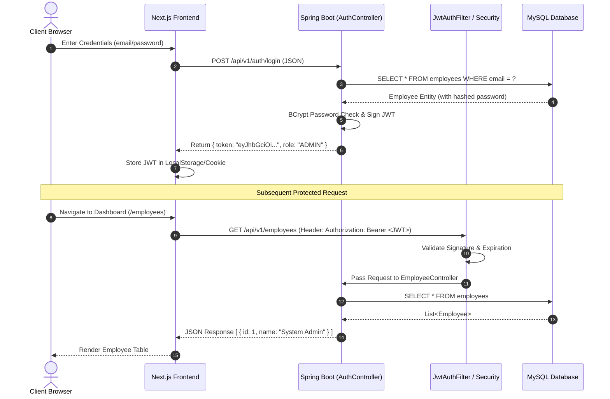

# HR Management System (HRMS) — End-to-End Architecture & Workflow Documentation

Welcome to the comprehensive technical documentation for the **HR Management System (HRMS)**. This document details the system architecture, internal directory structure, containerized network communications, authentication lifecycles, and configuration management from end to end.

---

## 1. System Overview & High-Level Architecture

The HRMS application is built using a modern **Three-Tier Microservices/Container Architecture**:
* **Presentation Layer (Frontend):** Next.js 14 (React) with Tailwind CSS, communicating via Axios.
* **Application Layer (Backend):** Java 17 with Spring Boot 3.2.5, Spring Security (JWT), and Hibernate JPA.
* **Data Persistence Layer (Database):** MySQL 8.0 community server.



---

## 2. Component breakdown & Directory Structure

### 🏗️ A. Root & Infrastructure (`d:\Hr-Management-System`)
The root directory orchestrates the environment variables and container deployment:
```
d:\Hr-Management-System\
├── .env                     # Centralized environment variables (Port, DB Secrets, JWT Key)
├── .env.sample              # Canonical template for team members (without sensitive credentials)
├── .gitignore               # Protects .env, target/ folders, node_modules from git commits
├── docker-compose.yml       # Multi-container orchestration, healthchecks, bridge networking
└── DOCUMENTATION.md         # Full project technical documentation
```

### 🎨 B. Presentation Layer (`frontend/`)
Built on **Next.js 14**, providing a responsive UI for Administrators, HRs, and Employees:
```
frontend/
├── Dockerfile               # Multi-stage Docker build (deps -> builder -> runner)
├── package.json             # React, Next.js, Tailwind, Axios dependencies
└── src/
    ├── app/                 # Next.js App Router (Pages, Layouts, Routes)
    ├── components/          # Reusable UI components (Navbar, Modals, Forms)
    └── lib/
        └── axios.js         # Configured HTTP client targeting NEXT_PUBLIC_API_BASE_URL
```

### ⚙️ C. Application Layer (`backend/hrms/`)
Built with **Spring Boot 3.2.5**, managing enterprise logic, RBAC (Role-Based Access Control), and data persistence:
```
backend/hrms/
├── Dockerfile               # Multi-stage Maven build & Eclipse Temurin JRE 17 runner
├── pom.xml                  # Maven dependencies (Spring Web, Security, JPA, MySQL, JJWT)
└── src/main/
    ├── java/com/hrms/
    │   ├── HrmsApplication.java     # Application Bootstrapper
    │   ├── config/
    │   │   ├── AppConfig.java       # Bean configurations (Cors, PasswordEncoder)
    │   │   └── DataSeeder.java      # Idempotent startup seeder for initial Admin/HR/Emp accounts
    │   ├── controller/              # REST Endpoints (@RestController for /api/v1/auth, /employee, etc.)
    │   ├── entity/                  # Hibernate ORM Models (Employee, Department, Leave, etc.)
    │   ├── enums/                   # Role definitions (ADMIN, HR, EMPLOYEE)
    │   ├── repository/              # Spring Data JPA Interfaces (EmployeeRepository)
    │   ├── security/                # JWT Token Generation, Verification, & JwtAuthFilter
    │   └── service/                 # Core business logic implementations
    └── resources/
        ├── application.properties        # Main Spring configuration (Docker profile defaults)
        └── application-local.properties  # Local host dev overrides (H2/Localhost DB)
```

---

## 3. End-to-End Request & Lifecycle Workflows

### 🔐 A. Authentication & JWT Authorization Flow
1. **Login Submission:** The client enters credentials (`admin@hrms.com / Admin@123`) on the React login page.
2. **Axios Request:** `axios.post('/api/v1/auth/login')` sends the JSON payload to `http://localhost:8080/api/v1/auth/login`.
3. **Controller Validation:** `AuthController` invokes `AuthService` to verify the email and password hash (`BCrypt`).
4. **Token Issuance:** If verified, `JwtService` signs a secure JSON Web Token (`JWT`) using `JWT_SECRET` (`HS256` algorithm) and returns it alongside role metadata (`ADMIN`, `HR`, or `EMPLOYEE`).
5. **Authenticated Requests:** For subsequent requests (`GET /api/v1/employees`), the frontend attaches `Authorization: Bearer <token>` in the HTTP header.
6. **Filter Interception:** `JwtAuthFilter` intercepts the request, validates the token signature, extracts the user `email` and `role`, and sets the `SecurityContext` so Spring knows the user is authenticated and authorized.



---

### 🌱 B. Automatic Idempotent Data Seeding (`DataSeeder.java`)
When `hrms-backend` starts inside Docker, Spring Boot initializes the database connection (`HikariCP`). Before serving web requests, `CommandLineRunner` executes `DataSeeder.run()`:
1. **Reads Environment Config:** Extracts `${seed.admin.email}`, `${seed.admin.password}`, etc. from `application.properties` / `.env`.
2. **Checks Existence:** Queries `employeeRepository.existsByEmail(adminEmail)`.
3. **Conditional Insertion:**
   * If the account **does not exist** (e.g., first run on a fresh database volume), it creates an `Employee` record, encodes the password (`BCrypt`), and saves it.
   * If the account **already exists**, it skips insertion silently. This ensures safe, idempotent restarts without duplicate key errors (`MySQL Error 1062`).

---

## 4. Docker Bridge Networking & Internal DNS

Understanding how containers communicate across `hrms-network` is vital for maintaining and debugging containerized environments:

### 🌐 A. Why Service Hostnames (`db`, `backend`) Are Used
Inside Docker Compose, each container receives its own internal IP address on the virtual bridge network (`172.18.0.X`). Because IPs can change on container recreation, Docker runs a **built-in DNS Server (`127.0.0.11`)** that maps `docker-compose.yml` service names (`db`, `backend`, `frontend`) to their current internal IPs.

* **Database Connection URL (`jdbc:mysql://db:3306/hrms_db`):**
  When Spring Boot (`hrms-backend`) connects to MySQL, it asks `127.0.0.11` to resolve `db`. Docker maps `db` to `hrms-db:3306`.
* **Why `localhost:3306` inside Docker Fails:**
  Inside the `hrms-backend` container, `localhost` refers exclusively to the container's own internal loopback interface (where only Java/Tomcat runs). Connecting to `localhost:3306` from inside the backend container results in `java.net.ConnectException: Connection refused`.

### 🩺 B. Orchestrated Startup & Healthchecks
To prevent Spring Boot from crashing (`Unable to open JDBC Connection for DDL execution`) when MySQL takes 15–20 seconds to boot:
1. `hrms-db` defines an active healthcheck using `CMD-SHELL`:
   ```yaml
   healthcheck:
     test: ["CMD-SHELL", "mysqladmin ping -h localhost -u root -p$$MYSQL_ROOT_PASSWORD || exit 1"]
     interval: 10s
     retries: 5
     start_period: 20s
   ```
2. `hrms-backend` specifies `depends_on` with `condition: service_healthy`.
3. When `docker compose up -d` runs, Docker waits until `mysqladmin ping` returns exit code `0` before executing `java -jar app.jar` in `hrms-backend`.

---

## 5. Configuration & Environment Variable Hierarchy

The system enforces a strict separation between code and credentials using environment variable substitution:

| Variable Name | Defined In (`.env`) | Consumed By (`docker-compose.yml`) | Injected Into (`application.properties` / Spring Boot) | Purpose |
| :--- | :--- | :--- | :--- | :--- |
| `DB_PASSWORD` | `my_secure_secret...` | `MYSQL_ROOT_PASSWORD: ${DB_PASSWORD}` | `spring.datasource.password=${DB_PASSWORD}` | MySQL root/user password |
| `SPRING_DATASOURCE_URL` | `jdbc:mysql://db:3306/...` | `SPRING_DATASOURCE_URL: ${SPRING_DATASOURCE_URL}` | `spring.datasource.url=${SPRING_DATASOURCE_URL}` | JDBC connection endpoint |
| `JWT_SECRET` | `hrms_super_secret_key...` | `JWT_SECRET: ${JWT_SECRET}` | `jwt.secret=${JWT_SECRET}` | HMAC SHA-256 signing secret |
| `SEED_ADMIN_PASSWORD` | `Admin@123` | `SEED_ADMIN_PASSWORD: ${...}` | `seed.admin.password=${SEED_ADMIN_PASSWORD}` | Default admin password |
| `BACKEND_PORT` / `PORT` | `8080` | `PORT: ${BACKEND_PORT:-8080}` | `server.port=${PORT:8080}` | Tomcat listening port |

---

## 6. Quick Start & Operation Guide

### 🚀 Option A: Run Entire Stack with Docker Compose (Recommended)
From the project root (`d:\Hr-Management-System`), launch the complete three-tier application:
```powershell
# Build and start all services in detached mode
docker compose up -d --build

# Check the status of all containers (db, backend, frontend)
docker compose ps

# View real-time logs for the Spring Boot backend
docker compose logs -f backend
```
* **Frontend Access:** `http://localhost:3000`
* **Backend API Base:** `http://localhost:8080`
* **Database Host (from external tool like DBeaver/Workbench):** `localhost:3306`

### 💻 Option B: Local Host Development (Without Docker for Backend)
If developing Spring Boot code locally using IntelliJ/Eclipse while keeping MySQL in Docker:
1. Start only the database container:
   ```powershell
   docker compose up -d db
   ```
2. Run Spring Boot with the `local` profile (`application-local.properties`):
   ```powershell
   cd backend\hrms
   mvn spring-boot:run -Dspring-boot.run.profiles=local
   ```

---

### 📚 Maintenance Commands
```powershell
# Gracefully stop all containers
docker compose stop

# Stop and remove containers, networks, and volumes (⚠️ resets database data)
docker compose down -v

# Rebuild only the backend after code modifications
docker compose build backend && docker compose up -d backend
```
